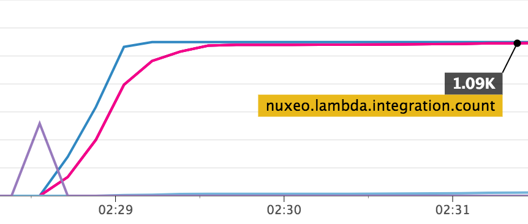

## Nuxeo Lambda Picture View Conversion

#### About

##### General
The contribution redirects all image conversion to AWS Lambda.
Currently, Nuxeo Lambda used for picture conversion creation.

##### Performance
AWS Lambda dramatically speeds up computation time.
Benchmarks show the ability to recompute a thousand of various PSD files (18 - 600MB)in less than 2 minutes.
In the benchmark test, each entry creates 4 picture views of different size.


##### Limitations
Currently AWS Lambda limited with:

- 1536 MB RAM
- 5 minutes of execution time
- 500 MB of storage for each lambda
- 1000 concurrent calls

#### Installation

The contribution contains two parts. 
In **nuxeo-lambda-image-conversion** you can find server side contribution.
This should be build with regular maven command from the root directory.
 
`mvn clean install`

**aws_lambda_impl** contains code ready to use on AWS Lambda. 
By default AWS has **Imagemagick** version 6.x.
We highly recommend to update it to the 7th version.

To do so, you need to build **Imagemagick** from source under the same environment used on AWS.
You can use the following script:

```bash
#!/usr/bin/env bash
sudo yum -y install libpng-devel libjpeg-devel libtiff-devel gcc
curl -O http://www.imagemagick.org/download/ImageMagick.tar.gz
tar zxvf ImageMagick.tar.gz
cd ImageMagick
./configure --prefix=/var/task/imagemagick --enable-shared=no --enable-static=yes
make
sudo make install
tar zcvf ~/imagemagick.tgz /var/task/imagemagick/
```

At the end you will have `imagemagick.tgz` file. Move it to **aws_lambda_impl**
To prepare Lambda for upload, use following commands:

```bash
cd aws_lambda_impl
npm i
zip -r lambda.zip *
```

Now, `lambda.zip` is ready to be uploaded to your AWS Lambda. 
If you have not yet created your AWS Lambda, please follow the official
[documentation](http://docs.aws.amazon.com/lambda/latest/dg/getting-started.html).

Make sure that you configured your function accordingly with your requirements. 
We suggest to set timeout at least to 2 minutes. Average RAM consumptions is about 700 MB for PSDs under 300MB.

## About Nuxeo
Nuxeo dramatically improves how content-based applications are built, managed and deployed, making customers more agile, innovative and successful. Nuxeo provides a next generation, enterprise ready platform for building traditional and cutting-edge content oriented applications. Combining a powerful application development environment with SaaS-based tools and a modular architecture, the Nuxeo Platform and Products provide clear business value to some of the most recognizable brands including Verizon, Electronic Arts, Netflix, Sharp, FICO, the U.S. Navy, and Boeing. Nuxeo is headquartered in New York and Paris. More information is available at [www.nuxeo.com](http://www.nuxeo.com/).
